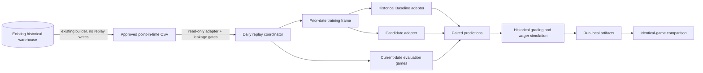

# Historical Replay Engine - architecture and integration boundary

## Architecture



## Folder structure

```text
research/historical_replay/
  ARCHITECTURE.md
  README.md
  config.py                 immutable experiment contracts
  isolation.py              approved reads and research-only write guard
  data_adapter.py           point-in-time dataset validation and date slicing
  models.py                 research-only model adapters
  engine.py                 expanding daily replay and artifacts
  metrics.py                statistical, wagering, calibration, and drawdown metrics
  cli.py                    explicit research entry point
  experiments/
    example_moneyline/
      config.json
      runs/<run id>/         immutable run outputs
  tests/                     leakage, isolation, concurrency-independent metrics
```

## Interfaces with production

There is only one interface: a read-only CSV adapter to `data/platform/historical_features.csv` or the accepted-feature derivative. The replay package does not call production code to regenerate features because several production helpers can fetch live APIs, mutate caches, or write platform state. The historical dataset remains owned by the existing platform.

## Intentionally separate

- Production `picks.db`
- Model registry and champion pointers
- Shadow inference and promotion logic
- Discord and notification outbox
- Flask routes and dashboard
- launchd and automation scheduler
- Live odds, MLB polling, and wager execution
- Production analytics and generated reports

## Assumptions

1. `feature_as_of == game_date` means shifted completed-game features are available at the closing-price replay instant.
2. Closing lines are valid pregame inputs but cannot measure CLV without an earlier entry quote.
3. Daily granularity is the strongest timestamp available; same-day games do not train on one another.
4. Historical outcomes are labels only and are excluded from feature selection.
5. Historical Baseline is the configured replay comparator, not the live registry champion artifact, whose modern feature schema is not reproducible on the 2012-2021 platform dataset.

## Remaining limitations

- No timestamped historical lineups or pregame weather forecasts.
- No historical active-bullpen snapshot.
- No multi-timestamp odds and therefore no true CLV.
- Closing-market replay can overstate practical price availability.
- Daily retraining is computationally expensive and is not an online-learning approximation.
- Feature importance is model-native and descriptive, not causal.
- ROI is sensitive to the configured edge and stake rules and must not be reused as a promotion criterion without a predeclared untouched evaluation window.

## Path to eventual integration

Do not integrate now. First require repeated leakage-test success, deterministic reruns, paired-game comparisons, and stable conclusions across multiple untouched chronological windows. Then run the winning configuration through a separate live feature-equivalence audit and shadow adapter. Only after shadow results agree should a production design proposal be reviewed; promotion must remain outside this package.
