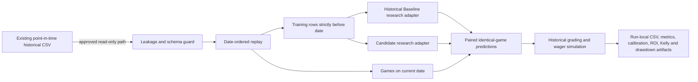

# Historical Replay Engine - final engineering report

## Status

The isolated research engine is operational. It has no production entry point and performed no writes outside `research/historical_replay/`. A representative smoke replay evaluated an Extra Trees research baseline and Logistic Regression candidate on the same 95 games from 2021-09-01 through 2021-09-07. This small run validates mechanics only; it is not model-promotion evidence.

## 1. Architecture diagram

## 2. Folder structure

See `ARCHITECTURE.md`. Code, tests, configurations, experiments, and generated artifacts all live beneath this directory. Each run uses `experiments/<name>/runs/<UTC id>/` and never overwrites an earlier run.

## 3. Interfaces with production

The sole interface is read-only access to one of two approved point-in-time CSVs owned by the existing historical platform. The replay does not import production inference, live feature fetching, model registry, shadow inference, notifications, Flask routes, scheduler, or betting execution. Dataset bytes are hashed into every run.

## 4. Components intentionally separate

- Production inference and champion
- Registry and promotion logic
- Shadow mode
- Discord and notification outbox
- Live odds and MLB polling
- Production database and warehouse writes
- Analytics dashboard and production reports
- launchd and background automation

## 5. Assumptions

- Replay occurs at the stored closing-price instant.
- Closing odds are pregame inputs, not CLV observations.
- Shifted rolling statistics are available by the game date.
- Same-day games cannot train on each other because intraday ordering is unavailable.
- Historical Baseline is a configured replay comparator, not the incompatible modern production champion.

## 6. Remaining limitations

- No historical timestamped pregame lineup, weather forecast, or active bullpen snapshot.
- No earlier market quote, so true CLV is explicitly unavailable.
- Stored closing prices may not represent executable prices or limits.
- Daily full retraining is deliberately exact but computationally expensive.
- Model-native importance is descriptive rather than causal.
- The smoke run contains only 95 games and proves mechanics, not value.
- Calibration supports chronological held-out sigmoid/isotonic experiments but has not yet been benchmarked in a full replay.

## 7. Recommended path to eventual integration

1. Keep the engine research-only.
2. Predeclare several untouched multi-season replay windows.
3. Require deterministic reruns and continuous leakage-test success.
4. Compare candidates only on paired identical games and demand consistent Log Loss, Brier, calibration, economic, segment, and drawdown behavior.
5. Audit feature equivalence between historical replay and live inference.
6. Move only a winning idea into a separate shadow adapter.
7. Consider production integration only after shadow evidence agrees. Promotion remains outside this engine.

## Verification

- 11 isolated tests pass.
- Future feature timestamps are rejected.
- Training dates are strictly earlier than replay dates.
- Outcome and postgame-looking columns are rejected.
- Untimestamped lineup and weather columns are rejected.
- Unapproved datasets and production write paths are rejected.
- Smoke replay produced all required artifacts.
- Both models covered exactly 95 identical games.
- Observed look-ahead violations: zero.
- Observed paired-game violations: zero.
- CLV report correctly states unavailable rather than fabricating a value.
